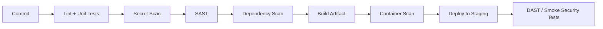

# Shift-Left Security in CI/CD

## Abstract

Shift-left security moves validation **closer to the developer**  at commit, pull request, and build time  so defects are cheaper to fix and fewer vulnerabilities reach production.

## Core principles

1. **Fast feedback**  Security scans on every PR should complete in minutes, not hours.
2. **Actionable results**  Findings must include file, line, severity, and remediation guidance.
3. **Policy tiers**  Block on critical/high; warn on medium; track low in backlog.
4. **Shared ownership**  Security engineers define policies; developers fix findings in normal workflow.

## Reference pipeline stages

## Implementation checklist

- [ ] Pre-commit hooks for secrets and formatting
- [ ] PR-level SAST with GitHub/GitLab integration
- [ ] SBOM generation on release branches
- [ ] Signed artifacts and provenance metadata
- [ ] Security dashboard tied to deployment frequency and MTTR

## Metrics

| Metric | Target |
|--------|--------|
| Mean time to remediate critical findings | &lt; 48 hours |
| % PRs with security scan | 100% |
| Critical vulns in production | Trending down quarter-over-quarter |

## Conclusion

Shift-left is not about adding more tools  it is about **placing the right control at the right stage** with clear ownership and measurable outcomes.
