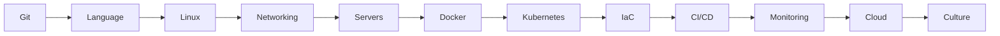

# DevOps Foundation Roadmap

The canonical **DevOps engineer** path: version control → automation → containers → cloud → CI/CD → observability. Security awareness is woven in early; full DevSecOps depth comes in the dedicated DevSecOps roadmap.

---

## The twelve steps

| Step | Topic | Time box | Outcome |
|------|--------|----------|---------|
| 1 | Git & collaboration | 1 week | PR workflow on a shared repo |
| 2 | Python or Go basics | 2 weeks | Automation script in repo |
| 3 | Linux & shell | 2 weeks | User management + cron job |
| 4 | Networking | 2 weeks | Explain DNS + TLS handshake |
| 5 | Web servers & proxies | 1 week | Nginx reverse proxy lab |
| 6 | Docker | 2 weeks | Multi-container Compose stack |
| 7 | Kubernetes | 3 weeks | Deploy + expose an app |
| 8 | Terraform / Ansible | 2 weeks | Reproducible environment |
| 9 | CI/CD | 2 weeks | Pipeline on every PR |
| 10 | Prometheus / Grafana | 2 weeks | Dashboard + one alert |
| 11 | AWS / Azure / GCP | 4+ weeks | One production-like project |
| 12 | DevOps culture | ongoing | Blameless postmortems, DORA metrics |

---

## Step details

### 1  Git

Master branching strategies (trunk-based vs GitFlow for your context). Understand **why** merge commits differ from rebase. Use signed commits if your org requires them.

### 2  Programming language

Pick **one** language and stay with it for six months. DevOps value comes from reading SDKs and writing glue  not algorithm contests.

### 3  Linux

Comfort on Ubuntu or RHEL. Know where logs live, how to debug disk full, and how `sudo` and groups interact.

### 4  Networking

Draw your home lab: client → DNS → load balancer → pod. Know common ports (22, 80, 443, 5432, 6379).

### 5  Server management

Configure Nginx or Caddy with TLS. Understand forward vs reverse proxy and when to use a CDN.

### 6  Containers

Optimize Dockerfile layer cache. Never run as root in production images. Pin base image digests.

### 7  Kubernetes

`kubectl` fluency: debug CrashLoopBackOff, inspect events, port-forward. Learn Helm for packaging, not as a crutch for missing GitOps discipline.

### 8  Infrastructure as Code

Terraform for provisioning; Ansible (or cloud-init) for configuration. **Never** edit production by hand without a ticket.

### 9  CI/CD

Stages: lint → unit test → integration test → build artifact → deploy. Cache dependencies. Fail fast.

### 10  Observability

RED/USE methods. One SLI per service. Alerts must be actionable  if it wakes someone at 3 a.m., it must be fixable.

### 11  Cloud

Start with free tier. Build: VPC, compute, managed DB, object storage, IAM roles (not long-lived keys).

### 12  Culture

Read *The DevOps Handbook* and *Accelerate*. Measure lead time, deployment frequency, MTTR, change failure rate.

---

## What to build as proof

| Artifact | Demonstrates |
|----------|----------------|
| Public GitHub repo with Actions | CI/CD |
| Terraform module with README | IaC |
| Blog post or Research Core note | Communication |
| Mini K8s demo with ingress + TLS | Platform skills |

---

## Next steps

- Security-heavy roles → [DevSecOps Learning Roadmap](/research-core/05-learning-and-roadmaps/devops-learning-hub/Chapter-1/devsecops-learning-roadmap)
- Senior staff track → [Senior Platform Gap Checklist](/research-core/05-learning-and-roadmaps/devops-learning-hub/Chapter-1/senior-platform-gap-checklist)
