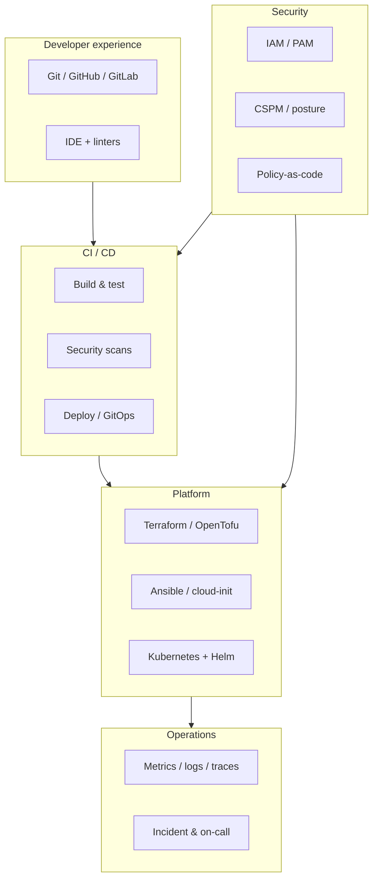

# DevOps Tools by Layer

Production platforms stack tools in **layers**. Learn the layer's job before memorizing vendor names. This guide reflects stacks seen across AWS, GCP, Azure, and on-prem Kubernetes.

---

## Layer model

---

## Must-learn vs alternatives

| Layer | Learn first | Common alternatives | When to switch |
|-------|-------------|---------------------|--------------|
| Version control | Git + GitHub or GitLab | Bitbucket, Azure Repos | Org mandate |
| CI/CD | GitHub Actions | Jenkins, GitLab CI, CircleCI, Azure Pipelines | Self-hosted plugins, enterprise templates |
| Containers | Docker | Podman, containerd direct | Rootless, no daemon |
| Orchestration | Kubernetes | Nomad, ECS, Cloud Run | Simpler workloads, serverless |
| IaC | Terraform | OpenTofu, Pulumi, CloudFormation, Bicep | Policy, language preference |
| Config management | Ansible | Chef, Puppet, Salt | Legacy estates |
| GitOps | Argo CD or Flux | Spinnaker | K8s-native delivery |
| Metrics | Prometheus + Grafana | Datadog, CloudWatch, Azure Monitor | Managed budget, correlation |
| Logs | Loki or ELK | Splunk, Cloud Logging | Scale, compliance |
| Traces | OpenTelemetry | Jaeger, Tempo, vendor APM | Standardization |
| Secrets | Vault or cloud KMS | Sealed Secrets, SOPS | Cloud-native vs portable |
| Policy | OPA / Gatekeeper | Kyverno, cloud policy engines | K8s admission focus |
| SAST | Semgrep, CodeQL | SonarQube, Checkmarx | Language coverage |
| SCA | Dependabot, Snyk | Grype, Trivy in CI | License + CVE depth |

---

## Learning order (practical)

1. **Git + one CI** — every other tool hooks here.
2. **Docker + Compose** — before Kubernetes complexity.
3. **Terraform** — one module you reuse across projects.
4. **Kubernetes + Helm** — one cluster, three apps.
5. **Prometheus/Grafana or cloud monitor** — one golden-signals dashboard.
6. **One scanner in CI** — fail builds on critical CVEs.
7. **Vault or managed secrets** — rotate one credential end-to-end.

---

## Anti-patterns

| Trap | Better approach |
|------|-----------------|
| Adopting Kubernetes for a single monolith | Managed PaaS or VMs until team size justifies ops cost |
| Five overlapping CI systems | Standardize on one; wrap exceptions |
| Dashboards without owners | Each dashboard has a team and on-call rotation |
| Security tools with no enforcement | Policy gate in pipeline or admission controller |

---

## Hands-on labs (self-guided)

| Lab | Time | Proves |
|-----|------|--------|
| Dockerfile + multi-stage build | 2 h | Image hygiene |
| Terraform remote state + workspace | 4 h | IaC discipline |
| Helm chart with values per env | 4 h | Packaging |
| Argo CD sync from git tag | 4 h | GitOps |
| Trivy scan in GitHub Action | 2 h | DevSecOps gate |

---

## Research Core deep dives

- [CI/CD Pipelines](/research-core/02-platform-cloud/ci-cd-pipelines/introduction)
- [Infrastructure as Code](/research-core/02-platform-cloud/infrastructure-as-code/introduction)
- [Logging and Monitoring](/research-core/03-operations-reliability/logging-and-monitoring/introduction)
- [DevSecOps](/research-core/01-security-engineering/devsecops/introduction)
