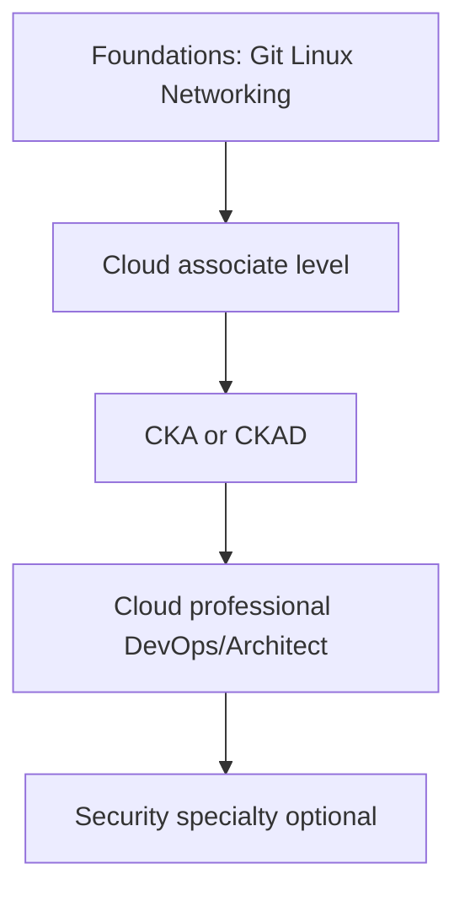

# Certification Roadmap

Certs are **structured syllabi**, not job guarantees. Take them after hands-on labs  exams reward services you have actually configured.

---

## Recommended sequences

### Platform / DevOps track

| Stage | AWS | Azure | GCP |
|-------|-----|-------|-----|
| Associate | Solutions Architect Associate | AZ-104 Administrator | Associate Cloud Engineer |
| Kubernetes | CKA (admin) or CKAD (apps) | Same  vendor-neutral | Same |
| Professional | DevOps Engineer Pro | AZ-400 DevOps Engineer | Professional Cloud Architect |
| Security add-on | Security Specialty | SC-200 / AZ-500 | Professional Cloud Security Engineer |

### Security-first track (DevSecOps)

| Order | Cert | Why |
|-------|------|-----|
| 1 | Cloud associate (any provider) | IAM, logging, network baseline |
| 2 | CKA | Where workloads actually run |
| 3 | Provider security specialty | Detective controls, encryption, governance |
| 4 | CISSP or CCSP (experience-gated) | Architecture vocabulary for leadership |

---

## Kubernetes (vendor-neutral)

| Exam | Audience | Study focus |
|------|----------|-------------|
| **CKA** | Cluster operators | `kubectl`, troubleshooting, etcd backup concepts |
| **CKAD** | App developers | Deployments, probes, ConfigMaps, multi-container |
| **CKS** | Security engineers | Pod security, network policy, supply chain  **after CKA** |

**Lab rule:** Use `kubectl` daily for 30 days before booking CKS.

---

## Study tactics that work

| Tactic | Detail |
|--------|--------|
| Hands-on first | 70% lab, 30% reading |
| Timed practice exams | Simulate pressure; review **every** wrong answer |
| Service cheat sheet | One-page per service: purpose, pricing model, integrates with |
| Whiteboard architectures | Draw before clicking console |
| Teach back | Explain VPC peering to a peer in 5 minutes |

---

## What certs do not replace

- Production incident ownership
- Code in git (pipelines, modules, policies)
- Communication with security and product teams

Document those in your portfolio and [Research Core](/research-core/introduction) articles.

---

## 12-week cert sprint (template)

| Weeks | Activity |
|-------|----------|
| 1–2 | Syllabus gap analysis vs [Cloud Study Plans](/research-core/05-learning-and-roadmaps/devops-learning-hub/Chapter-2/cloud-provider-study-plans) |
| 3–8 | Daily 1 h lab on weakest domains |
| 9–10 | Two full practice exams |
| 11 | Review weak domains only |
| 12 | Exam |

---

## Maintainer note

Krishna Neupane's portfolio emphasizes **production DevSecOps**  prioritize CKA + cloud security specialty if your role owns cluster and cloud posture together.
